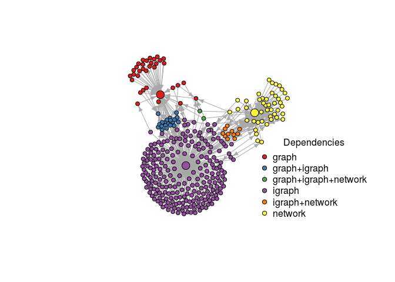

Build and analyze network of CRAN packages
================
2016-08-12 16:57:01

[](https://travis-ci.org/mbojan/pkgnet) [](https://ci.appveyor.com/project/mbojan/pkgnet) [](http://cranlogs.r-pkg.org/) [](https://cran.r-project.org/package=pkgnet)

Package `DESCRIPTION` files allows for specifying several types of inter-package relations. These include fields like Depends, Suggests, Enhances etc. This package allows for recovering graph structure based on these relations. Network representation of R repositories enables the user to explore the interconnected space of available R functionality while the developers or repository maintainers can scan package forward and reverse dependencies etc.

The main function `pkgnet` creates an igraph object of packages available in specified repository containing all other fields from `available.packages` as vertex and edge attributes.

Examples
========

Network based on current snapshot of CRAN
-----------------------------------------

This will fetch data on packages available on CRAN at this very moment and transform it to an igraph object:

``` r
g <- pkgnet("cran")
summary(g)
```

    ## IGRAPH DN-- 9186 47048 -- 
    ## + attr: name (v/c), Version (v/c), Priority (v/c), License (v/c),
    ## | License_is_FOSS (v/c), License_restricts_use (v/c), OS_type
    ## | (v/c), Archs (v/c), MD5sum (v/c), NeedsCompilation (v/c), File
    ## | (v/c), Repository (v/c), type (e/c)

Thus today (2016-08-12) we have 9186 packages in total. This however includes also packages that are not available on CRAN, but are mentioned by other packages in their `DESCRIPTION` files. This can be checked using the `Repository` field which will be equal to `NA` for packages not available on CRAN:

``` r
sum( is.na(V(g)$Repository) )
```

    ## [1] 248

Graph of packages related to network analysis
---------------------------------------------

Let extract a subgraph of packages depending (`Depends`, `Imports`, or `Suggests`) on one of the packages providing facilities to store and process network data ("graph", "igraph", "network", "networkDynamic").

Get the neighborhoods and make the graph:

``` r
# Seed packages
seeds <- c("igraph", "network", "graph")

# Only dependence arcs
depnet <- delete.edges(g, E(g)[ !(type %in% c("Depends", "Imports", "Suggests")) ])

# list of package names
pkg_names <- ego(depnet, 1, V(depnet)[ name %in% seeds ], mode="in" )
sg <- simplify( induced_subgraph(depnet, unique(unlist(pkg_names))) )
summary(sg)
```

    ## IGRAPH DN-- 344 563 -- 
    ## + attr: name (v/c), Version (v/c), Priority (v/c), License (v/c),
    ## | License_is_FOSS (v/c), License_restricts_use (v/c), OS_type
    ## | (v/c), Archs (v/c), MD5sum (v/c), NeedsCompilation (v/c), File
    ## | (v/c), Repository (v/c)

Plot it such that:

-   Arcs go "upstream"
-   Nodes for seed packages are larger
-   Colors show which of the "seed" packages a given package depends on

``` r
set.seed(2992)

# Coordinates
xy <- layout.fruchterman.reingold(sg)

# Colors
d <- distances(sg, to=V(sg)[ name %in% seeds], mode="out")
x <- apply(d, 1, function(x) paste(sort(colnames(d)[x == min(x)]), collapse="+"))
pal <- RColorBrewer::brewer.pal(length(unique(x)), "Set1")
cols <- pal[ match(x, sort(unique(x)))]

# Plot
plot(sg, 
     vertex.size=ifelse( V(sg)$name %in% seeds, 10, 5),
     vertex.color=cols,
     layout=xy, 
     vertex.label.color="black",
     # vertex.frame.color = par("bg"),
     edge.arrow.size=.5, 
     vertex.label=NA,
     margin=0
     )
legend("bottomright",
       title="Dependencies",
       sort(unique(x)),
       pch=21,
       pt.bg=pal,
       col="black",
       bty="n"
       )
```



Installation
============

``` r
devtools::install_github("mbojan/pkgnet")
```
